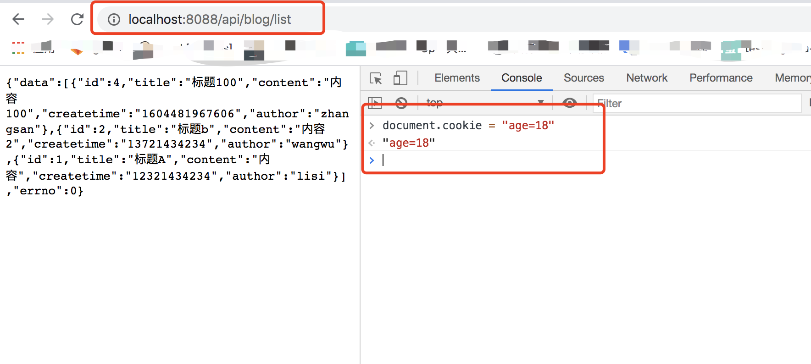
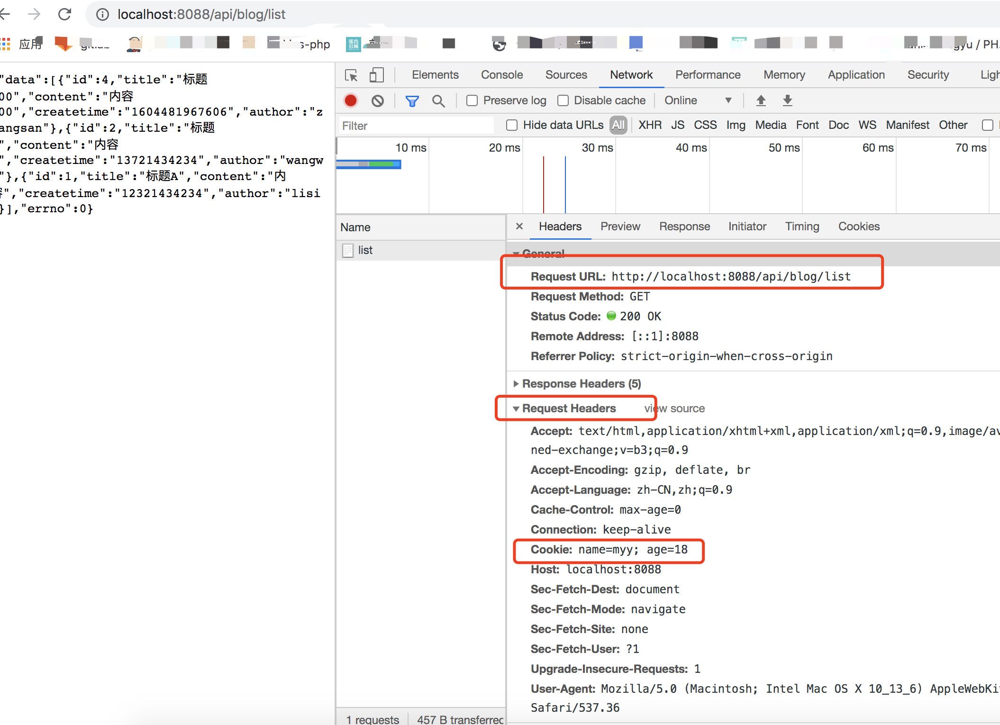
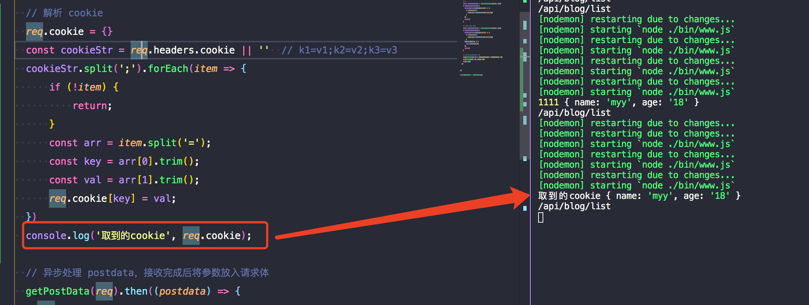

# node-athena

## node用途

- 作为 js 运行环境
- 运行在服务器作为一个 webserver
- 作为打包构架工具

## es、js、nodejs

- es：定义语法规范，如：如何定义变量 循环 判断 函数 原型 闭包 异步等
- 前端js：js（遵循es语法规范） + web API（遵循w3c标准-dom操作、bom操作、事件绑定、ajax等）
- nodejs：js（遵循es语法规范） + nodejs API（http、fs等）

## commonjs

- nodejs 中默认的模块化规范
- Node 应用由模块组成，采用 CommonJS 模块规范
- 符合单一职责原则和开发封闭原则
- demo按理 在commonjs-demo 文件夹中

## npm init 初始化 并安装lodash工具

- demo-commonjs.js:b.js测试三方库引用和使用

## vscode debugger

- 调试入口对应package.json中的"main": "bin/www.js",
- 点击小虫子开始测试

## server端重要的几个点

- 服务的稳定性：不能挂，pm2 进程守候（进程挂掉后自己重启）
- 内存和CPU：stream 写日志节约内存，Redis 存 session 扩展
- 日志记录：记录、存储、分析
- 安全：越权操作，数据库攻击，预防 xss 攻击，sql 注入
- 集群和服务：如何应对流量过大的问题

## 此项目开发的内容

- 以学习为目的开发一个具备博客基础功能的博客系统
- 课程最终目标学会如何使用nodejs开发webserver
- 不用框架开发
- 用 express 开发
- 用 koa2 开发
- 主要功能：首页-显示所有博客列表，作者页，博客详情页，登录页，管理中心-编辑/新建页(标题和正文)

## 技术方案

- 数据如何存储（博客、用户）- 设计表
- 接口设计

## 接口开发

- nodejs 处理 http 请求
- 搭建开发环境
- 开发接口（暂不连接数据库，不考虑登录）
- get 请求与 querystring
- post 请求与 postdata
- 路由
- 实例：demo-http-app.js
- node app.js 运行
- 浏览器访问 localhost:8000 进行get请求
- postman 测试 post请求

## 环境搭建

- 安装 nodemon 自动重启
- 安装 cross-env 设置环境变量兼容不同系统环境

## 项目目录

- 第一层：bin-www.js 创建 server，启动当前 node 服务
- 第二层：app.js 进行 server 相关统一配置，处理相应的请求，最终被引入到 www.js 中，被 createServer 时使用
- 第三层：建 src - router 文件夹，存放各个模块的路由，输出路由函数，路由函数最终被引入到app.js中被调用，当服务接收到请求后，匹配到对应的路由进行调用，传入res 和 req 参数，路由只关心路由，路由接收到参数后，从 controller 获取数据
- 建 model 文件夹， 存放数据模型，控制返回数据的一个清晰的模型，于是在路由中不会直接返回假数据，而是经过 model 包裹的数据
- 第四层：建 controller 文件夹，最关心数据的一层，被引入到路由文件中，接受参数，返回数据

## promise

- demo 中 promise 文件夹演示了 nodejs 读取文件和异步嵌套获取文件内容的过程

## api 与 路由

- api包括路由、输入、输出
- 路由：api的一部分，后端系统内部的一个定义的模块

## MySQL

- 安装 MySQL（数据库服务端）[](https://downloads.mysql.com/archives/community/)
- 安装过程中记住当时输入的 root 密码
- 安装成功后进入系统偏好设置找到 MySQL
- 进入/usr/local/mysql/bin,查看此目录下是否有mysql
- vim ~/.bash_profile 添加环境变量 export PATH=${PATH}:/usr/local/mysql/bin，使用zsh shell，编辑 ~/.zshrc 文件配置，并 source 配置文件
- 安装可视化数据库设计软件 MySQL Workbench，专为 MySQL 设计的可视化数据库建模工具[](https://downloads.mysql.com/archives/workbench/)
- 打开 Workbench，点击界面加号新建连接，输入连接相关信息，本地的话就是127.0.0.1，输入数据库密码，即安装 MySQL 时设置的密码，点击 ok 连接
- 建库，为此博客项目新建一个库，点击上方小圆柱加号，设置库名称，如 myblog，确认点击 apply，```CREATE SCHEMA `myblog` ```，继续确认 apply;
- 点击上方小sql加号，新建 sql file，输入 ```show databases;```点击小闪电运行，查看当前所有库
- 此时左侧 SCHEMAS 里面已经显示 myblog 库
- 点击展开 myblog，右击 tables 点 creat table，建 user/blog 表，输入表名，输入表column、datatype、PK(主键)、NN(不为空)、AI(自动增加)
- 修改表：右击 tables 点 alter table，删除表：右击 tables 点 drop table
- 编辑区输入 ```use myblog;``` 设置当前使用某个库
- 查看当前库所有表 ```show tables;``` ，注释使用双横杠 ```-- show tables; --```
- 向 user 表中插入数据 ```insert into users (username, `password`,  realname) values ('lisi', '123', '李四'  );```，password 为关键字，使用反引号括起来即可
- 查询所有表数据 ```select * from users;```
- 查询表某些列数据 ```select id, username from users;```
- 按条件查询表数据 ```select * from users where username = 'zhangsan' and `password` = '123';```
- 模糊查询表数据 ``` select * from users where username like '%lisi%' ```
- 查询数据排序 ```select id, username from users order by id;```，```select id, username from users order by id desc;```
- 更新表数据 ```update users set realname = '李四2' where username = 'lisi';```
- 点击运行会报错：Error Code: 1175. You are using safe update mode and you tried to update a table without a WHERE that uses a KEY column To disable safe mode, toggle the option in Preferences -> SQL Editor and reconnect.
- 运行 ```SET SQL_SAFE_UPDATES = 0``` 解决
- 删除表数据 ```delete from users where id = 4;```
- 实际工作中为预防删除数据，往往在表中增 state 列，修改 state 值为 0 或 1，软删除数据
- 如删除lisi ```update users set state = '0' where username = 'lisi';```，```select * from users where state <> '0';```
- 补充-修改表 column 名字 ```alter table blogs change column creattime createtime varchar(45);`，其中可修改内容： blogs 为表的名字，creattime 为 旧 column 名，createtime 为新 column 名，varchar(45)为新 column 类型

## 连接数据库

- 安装 ```cnpm install --save mysql```
- demo测试在 demo-mysql 文件中
- 终端运行 node index.js，后报错：Error: ER_NOT_SUPPORTED_AUTH_MODE: Client does not support authentication protocol requested by serv，原因：mysql8.0加密方式的原因报错。
- 解决报错：
  - 进入 mysql：```mysql -u root -p```
  - 输入mysql用户密码进入 mysql
  - 执行```use mysql;```
  - 执行```alter user 'root'@'localhost' identified with mysql_native_password by '11111111';```
  - 执行```flush privileges;```，成功过后输出 Query OK, 0 rows affected (0.07 sec)
  - 执行```quit```退出mysql
- 再次运行，数据查询数据

## 博客项目连接数据库

- 新建 src-conf-db.js，进行项目数据库连接配置
- 新建 src-db-mysql.js，创建连接，异步获取数据库数据，抛出一个函数->依据参数sql异步查询表数据返回 promise
- 修改 controller-blogs.js，编写查询 sql，调用上步函数传入 sql，抛出 promise
- 修改 router-blogs.js，取到上步抛出的 promise，.then获取查询结果并数据模型包裹后抛出，抛出此 promise，此时 router 抛出的不是假数据而是 promise
- 修改 app.js，将原本的res.end(假数据)中的假数据改为 promise.then 获取数据
- 浏览器进行 get 请求，报错，排查过程中将所有 promise 用 catch 捕捉异常，根据异常信息解决问题后请求成功
- 请求路径：[](http://localhost:8088/api/blog/list?author=lisi)
- 如上完成其他所有接口

## 登录（cookie、session、Redis）

- 登录涉及：登录校验与登录信息存储
- cookie 和 session
  - 存储在浏览器客户端
  - 有大小限制
  - 跨域不共享
  - 字符串非结构化数据，格式：k1=v1,k2=v2,k3=vs
  - 每次发送 http 会将请求域的 cookie 发送给 server 端
  - server 端可以修改 cookie 返回给浏览器
  - 浏览器也可以修改，但是可以限制，不让js修改
  - 浏览器查看 cookie 的三种方式：1.控制台请求的 response 和 request 的 header 信息中；2.application-storage 查看；3.```document.cookie```
  - js 修改 cookie ：```document.cookie = 'k1=11'```
  - server 端获取 cookie :```req.headers.cookie```
  - 测试：
  
  
  
  - server 端设置 cookie ```response.setHeader('Set-Cookie', 'username=lisi; path=/; httpOnly; expires=...;')```
  - 浏览器携带用户名和密码请求登录接口，接口获取到参数后查询 user 表，取到 user 表数据，将数据中的必要值通过上步方法设置 cookie，，通过 response headers 的 Set-Cookie 字段传送，这样浏览器客户端就存在了 cookie，下一次接口请求时会通过 request headers 的 Cookie 字段带着此 cookie
  - 为防止客户端修改 cookie 伪造登录，server 端设置 cookie 时加上 httpOnly，这样在前端使用 document.cookie 就无法修改该cookie，server 端获取的时候只会获取自己设置的 cookie
  - expires 设置 cookie 过期时间
  - cookie 中存放用户信息会暴露信息
  - server 端可以通过 ```req.cookie.```获取到当初存入 cookie 的数据，但是这样直接把数据暴露在客户端 cookie 中会有安全隐患
  - 为解决安全问题，设置 cookie 仅存放一个 userid 标识，sever 端通过解析此 userid 来获取对应用户信息，这就是 session 解决方案
  - 新建一个 SESSION_DATA 对象存放 {userid:{user数据}}
  - 在请求登录接口时，新建 userid 并设置为 cookie，并以此 userid 为键新建空数据 ```SESSION_DATA[userid]={}```，SESSION_DATA 专门用来存储 session，其中每一项 key 为 userid，val 为 session 数据
  - 将空数据赋值给 ```req.session = SESSION_DATA[userid]``` 以供使用 session 数据
  - 将依据登录接口参数查询到的表数据写入 req.session = ，此时 SESSION_DATA 会同步数据，登录成功后，之后请求的接口，请求时获取 cookie 中的 userid ，直接从 SESSION_DATA 取对应的 session 数据，赋值给对应的 req.session
- session 和 Redis
  - 上述session 存储在 ```const SESSION_DATA = {}``` 中，是一个变量，程序运行进程中的一个内存空间，操作系统会为程序运行的每个进程分配有限的内存块，进程的内存有限，如果访问量过大，session数据很大，内存就会爆掉了
  - 正式上线的时候会分配成多个进程来跑的，后多核处理器可以同时处理多个进程，每个进程都会有一个session，多进程之间内存数据无法共享。
  - 比如第一次访问命中了第一个进程，数据写进去了，第二次访问命中了第四个进程，那么之前访问的数据就看不到了（负载均衡）
  - web server 内存数据库，数据存在内存中，读写特别快，但内存昂贵，断电丢失
  - MySQL 硬盘数据库
  - Redis 内存数据库，可以用作数据库、缓存和消息中间件。把 session 单独拿出来放在 Redis 单独的服务器中存储，Redis可以扩展，性能方面有响应的解决方案
  - mac 安装 ```brew install redis```
  - 运行 ```/usr/local/bin/redis-server /usr/local/etc/redis.conf``` 后出现一个大logo，服务已经启动
  - 另起终端窗口执行```redis-cli```启动 Redis 客户端
  - 测试demo：```set myKey abc```,```get myKey```
  - ```keys *``` 查看所有键
  - ```del name```删除
  - ```quit``` 退出 Redis
- 测试 redis
  - 安装 ```cnpm install --save redis```
  - 实例：demo-redis-index.js
- 博客项目应用 Redis
  - conf-db.js 配置 Redis 服务相关变量
  - 新建 db-redis.js，配置启动 redis 服务，抛出 set 存储与 get 获取方法
  - 将原来用 SESSION_DATA 变量存储的 session 信息 改为用 redis 存储
  - 初始时同上理，没有从 cookie 中获取到 sessionid（即 userid ），则新建一个，插进去```set(新建的userId, {})```
  - 如果从 cookie 中获取到 sessionid，则依据此 id ，从 redis 中异步 get session 数据，获取到的话则 req.session 直接赋值，获取不到的话就赋值空
  - 对应的路由中，查询的表数据结果赋值完req.session后同步更新redis
  - 重新请求登录接口，成功后，查看 redis ```keys *``` 看到新插入key，如 1604571281467_0.241357995331726，```get 1604571281467_0.241357995331726```输出存入的 session 数据
  - 将增删改查博客的几个接口加上登录验证，且新建删除博客的接口需要 session 中的数据

## Nginx

- 题外话：```cnpm install http-server -g```，```http-server -p 8001```启动一个本地服务，浏览器访问[](http://localhost:8001/)，起服务访问前端静态资源
- Nginx 做高性能的静态服务
- Nginx 负载均衡配置，作为流量来的入口，然后分配到其他服务
- Nginx 反向代理（即对客户端不可见，是个黑盒），浏览器客户端能控制是正向代理
- 现测试：前端页面-8001，nodejs-8000，Nginx-8080
- 安装与配置 Nginx，本机host文件新增```127.0.0.1  my-first-node.com```，nginx 下 servers 文件夹新增配置文件 my-first-node.com.conf，内容如下，重启 nginx，浏览器访问 my-first-node.com，->即打开本机 8001 静态页面，静态页面请求本机 8000 服务，开始联调

  ```txt
  server {
    listen 80;

    server_name my-first-node.com;

    location / {
      proxy_buffering off;
      proxy_pass http://my-first-node.com:8001;
      add_header 'Access-Control-Allow-Origin' '*';
    }

    location /api/ {
      proxy_buffering off;
      proxy_pass http://localhost:8000;
    }
  }
  ```

## 日志

- 访问日志 access log
- 自定义日志
- 日志文件很大
- 日志存储到文件中，nodejs文件操作，nodejs stream
- 日志文件拆分，日志内容分析
- demo 文件夹新建 file 文件夹，测试 node 如何读写文件
- IO（in输入/out输出）：网络IO、文件IO
- demo 文件夹新建 steam 文件夹，测试 node 流操作

## express 框架

- 安装，使用脚手架 express-generator，```npm install express-generator -g```
- 初始化项目目录 ```express myblog-express```（app.js、bin、routes、views、public）
- npm i  -> npm start
- 安装与配置 Nginx

## Windows下安装

- 安装sql：参照 [](https://www.runoob.com/mysql/mysql-install.html) + 配置环境变量
- 安装 redis，下载压缩包[](https://github.com/tporadowski/redis/releases)，解压固定目录下放好，
cmd 切换至压缩包解压后所在文件夹运行```redis-server.exe redis.windows.conf```，配置好系统环境变量，```redis-server```启动，另起命令窗口，```redis-cli```进入redis编辑，```quit```退出
